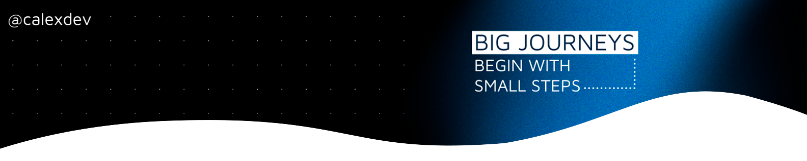

# Carlos Alexandre

**FullStack Developer ☕︎**

 

I hold a Bachelor's degree in Information Systems and currently work as a Java back-end developer. I have hands-on experience with agile methodologies such as Scrum, enabling me to collaborate effectively in teams and deliver high-quality projects on time.

My technical background includes expertise in RESTful APIs, messaging systems, Java EE, Spring Boot, Oracle and SQL Server databases, and Docker.

In addition, I have a strong personal interest in computer graphics.

