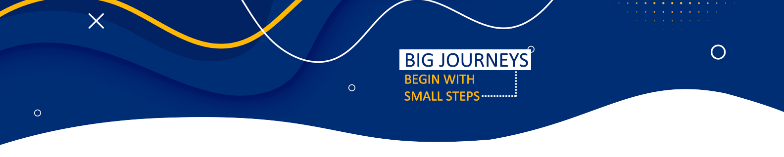

# Carlos Alexandre

**Desenvolvedor Java ☕**

 

Eu sou Bacharel em Sistemas de Informações e trabalho atualmente como desenvolvedor back-end Java. Possuo vivencia em metodologias ágeis, como Scrum, o que permite trabalhar de forma eficiente em equipes para entregar projetos de qualidade dentro do prazo. 

Tenho exeperiência em API Rest, mensageria, Java EE, SpringBoot, banco de dados Oracle/SQLServer e Docker. 

Além disso, uma paixão por computação gráfica.

